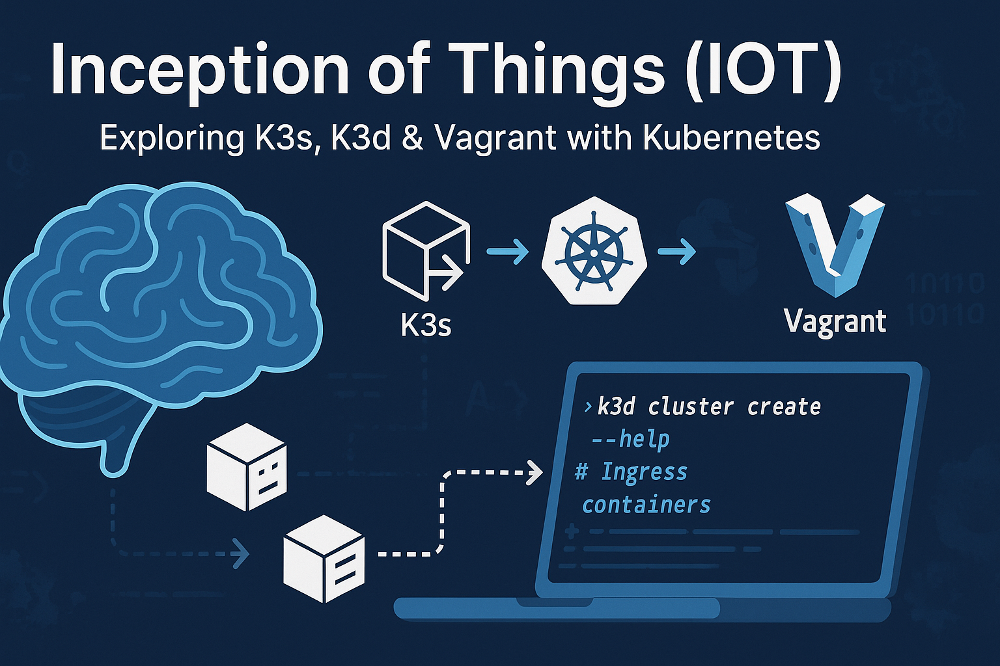

<div align="center">
  

# Inception of Things (IoT)

[](https://kubernetes.io/)
[](https://www.vagrantup.com/)
[](https://k3s.io/)
[](https://argoproj.github.io/cd/)

This project demonstrates container orchestration using K3s with Vagrant and K3D with ArgoCD. Create and manage lightweight Kubernetes clusters in various environments, from multi-node setups to GitOps-driven CI/CD pipelines.

</div>

## 📦 Project Structure

The project is organized into multiple parts:

### 🔷 Part 1: K3s Multi-Node Cluster


This part focuses on setting up a basic K3s cluster with server and worker nodes. K3s is a lightweight Kubernetes distribution perfect for edge computing, IoT applications, and development environments.

- **Server Node (`mbelouarS`)**:

  - IP Address: `192.168.56.110`
  - Role: K3s server/master
  - Components: K3s, kubectl

- **Worker Node (`mbelouarSW`)**:
  - IP Address: `192.168.56.111`
  - Role: K3s agent/worker
  - Labeled with `node-role.kubernetes.io/worker=worker`

### 🔷 Part 2: Single-Node K3s with Application Deployment

This part demonstrates deploying multiple applications on a single K3s server with Ingress routing. Learn how to manage traffic between applications using Kubernetes' native routing capabilities.

- **Server Node (`mbelouarS`)**:
  - IP Address: `192.168.56.110`
  - Deployments:
    - `app1-deployment`: Accessible via `app1.com`
    - `app2-deployment`: Accessible via `app2.com`
    - `app3-deployment`: Accessible as default backend

### 🔷 Part 3: CI/CD with K3D and ArgoCD


This part implements a CI/CD pipeline using K3D and ArgoCD on macOS. It demonstrates GitOps principles through automated deployments from a Git repository directly to Kubernetes.

- **Local K3D Cluster**:
  - Components: K3D, kubectl, ArgoCD
  - Deployments:
    - ArgoCD: Continuous delivery tool
    - Playground app: Simple application with 2 replicas

### 🔷 Bonus: GitLab Runner with ArgoCD Integration


This bonus part expands on Part 3 by adding GitLab Runner to create a complete CI/CD pipeline. It integrates GitLab CI with ArgoCD for a full GitOps workflow from code commit to deployment.

- **GitLab Runner Integration**:
  - Components: GitLab Runner, Helm, Kubernetes RBAC
  - Features:
    - Automated CI pipeline execution
    - Kubernetes-native job execution
    - Integration with ArgoCD's GitOps workflow
    - Complete end-to-end CI/CD pipeline
  - GitLab Project: [https://gitlab.com/simobelouarraq5/Inception-Of-Things](https://gitlab.com/simobelouarraq5/Inception-Of-Things)

## 🚀 Getting Started

### Prerequisites

- ✅ [Vagrant](https://www.vagrantup.com/downloads) (v2.2.19 or later) - for Parts 1 & 2
- ✅ [VMware Desktop](https://www.vmware.com/products/workstation-pro.html) (preferred) or VirtualBox - for Parts 1 & 2
- ✅ [Docker Desktop](https://www.docker.com/products/docker-desktop/) - for Part 3
- ✅ macOS operating system - for Part 3
- ✅ Sufficient RAM for VM allocation (minimum 2GB)
- ✅ ARM-based system (project uses ARM64 VM images) - for Parts 1 & 2

### 🔧 Installation

1. Clone this repository:

   ```bash
   git clone <repository-url>
   cd Inception-of-Things
   ```

2. Part 1: Deploy the multi-node K3s cluster

   ```bash
   cd p1
   mkdir -p token  # Create token directory for node sharing
   vagrant up
   ```

   > ℹ️ This creates both server and worker nodes and automatically establishes the cluster connection.

3. Part 2: Deploy the application server

   ```bash
   cd ../p2
   vagrant up
   ```

   > ℹ️ This deploys a single node with three applications and configures the Ingress controller.

4. Part 3: Set up K3D with ArgoCD for CI/CD

   ```bash
   cd ../p3
   make setup
   ```

   > ℹ️ This creates a local K3D cluster, installs ArgoCD, and sets up an application deployment with GitOps workflow.

5. Bonus: Set up GitLab Runner with ArgoCD for complete CI/CD pipeline

   ```bash
   cd ../bonus
   make setup
   ```

   > ℹ️ This extends the K3D cluster with GitLab Runner for a complete GitOps CI/CD pipeline integrated with GitLab.

### 🌐 Accessing Applications (Part 2)

To access the applications deployed in Part 2:

1. Add the following entries to your `/etc/hosts` file:

   ```
   192.168.56.110  app1.com
   192.168.56.110  app2.com
   ```

2. Access the applications via your browser:

   | Application | URL                                            | Description             |
   | ----------- | ---------------------------------------------- | ----------------------- |
   | App 1       | [http://app1.com](http://app1.com)             | Hello Kubernetes App 1  |
   | App 2       | [http://app2.com](http://app2.com)             | Hello Kubernetes App 2  |
   | Default App | [http://192.168.56.110](http://192.168.56.110) | Default backend (App 3) |

### 🌐 Accessing Applications (Part 3)

To access the applications deployed in Part 3:

1. Access ArgoCD UI:

   ```bash
   cd p3
   make port-forward
   ```

2. Access the ArgoCD dashboard:

   - URL: [https://localhost:8080](https://localhost:8080)
   - Username: `admin`
   - Password: (displayed during installation)

3. To access the deployed playground application, add this entry to your `/etc/hosts` file:

   ```
   127.0.0.1 playground.com
   ```

4. Then you can access it at [http://playground.com](http://playground.com)

## 🔍 Implementation Details

### Network Configuration


#### Parts 1 & 2

These parts use `eth1` (192.168.56.110/111) as the primary network interface for K3s communication, configured using the `--flannel-iface eth1` parameter. This ensures that:

- Cluster internal traffic uses the private network
- Flannel CNI provides proper pod networking
- VM-to-VM communication is isolated from host network traffic

#### Part 3

The K3D cluster in Part 3 uses Docker's network with port mappings:

- Port 80 and 443 mapped from the container to the host
- Internal Kubernetes API server accessible on port 6550
- ArgoCD UI available via port forwarding to localhost:8080

### Deployment Configuration

- **Part 1**: Uses script-based deployment with token sharing between nodes

  ```
  Server (192.168.56.110) ⟹ generates node-token ⟹ Worker (192.168.56.111)
  ```

- **Part 2**: Uses YAML configurations in the `apps-config/` directory to deploy applications with Ingress routing

  ```
  Ingress Controller ⟹ Service ⟹ Deployments ⟹ Pods
  ```

- **Part 3**: Uses ArgoCD with GitOps approach for application deployment and management
  ```
  Git Repository ⟹ ArgoCD ⟹ K3D Cluster ⟹ Pods
  ```

### Docker Images

#### Parts 1 & 2

The applications use the `mbelouar/hello-kubernetes:arm` container image which runs a simple web server on port 5678, displaying information about the pod, node, and namespace.

#### Part 3

The application uses the `wil42/playground:v1` container image which runs on port 8888, a simple web application that ArgoCD automatically deploys and manages.

## ⚠️ Troubleshooting

| Issue                             | Solution                                                                                           |
| --------------------------------- | -------------------------------------------------------------------------------------------------- |
| **K3s fails to start**            | Verify that the `eth1` interface is properly configured in your VM. Check with `ip addr show eth1` |
| **Worker not joining**            | Ensure the `token` directory exists and contains the node-token file from the server               |
| **Apps not accessible**           | Verify your `/etc/hosts` file contains the correct entries for app1.com and app2.com               |
| **VMware network issues**         | Add `vb.vmx["ethernet0.pcislotnumber"] = "160"` to your VMware provider config in Vagrantfile      |
| **K3D cluster creation fails**    | Ensure Docker is running. Try `docker ps` to verify Docker daemon is active                        |
| **ArgoCD UI not accessible**      | Check if port-forward is running with `make port-forward` in the p3 directory                      |
| **ArgoCD application sync fails** | Verify Git repository access and correct path to manifests in application.yaml                     |
| **GitLab Runner not registering** | Check registration token in `bonus/helm/gitlab-runner-values.yaml`                                 |
| **Runner pods stuck in Pending**  | Verify architecture compatibility in helper_image configuration                                    |

## 📝 Project Structure

```
.
├── README.md
├── images/
│   └── Inceptionofthings.png
├── p1/                           # Part 1: Multi-node K3s Cluster
│   ├── Vagrantfile               # VM configuration for server and worker
│   ├── scripts/                  # Provisioning scripts
│   │   ├── copy_token.sh         # Share token between nodes
│   │   ├── k3s.sh                # Install K3s server
│   │   ├── kubectl.sh            # Install kubectl
│   │   ├── label_worker.sh       # Label worker node
│   │   └── worker.sh             # Configure worker node
│   └── token/                    # Shared token directory
├── p2/                           # Part 2: Application Deployment
│   ├── Vagrantfile               # VM configuration for app server
│   ├── apps-config/              # Kubernetes resource definitions
│   │   ├── app1.yaml             # First application deployment
│   │   ├── app2.yaml             # Second application deployment
│   │   ├── app3.yaml             # Default application deployment
│   │   └── ingress.yaml          # Ingress routing configuration
│   └── scripts/
│       └── startup.sh            # K3s installation and app deployment
├── p3/                           # Part 3: CI/CD with K3D and ArgoCD
│   ├── Makefile                  # Main automation commands
│   ├── scripts/                  # Setup and utility scripts
│   │   ├── cleanup.sh            # Cleans up resources
│   │   ├── create_cluster.sh     # Creates the K3D cluster
│   │   ├── install_argocd.sh     # Installs and configures ArgoCD
│   │   ├── setup_ns.sh           # Sets up required namespaces
│   │   └── startup.sh            # Main setup script
│   └── src/                      # Application source files
│       ├── application.yaml      # ArgoCD application definition
│       └── dev/                  # Kubernetes manifests for the app
│           ├── deployment.yaml   # App deployment configuration
│           ├── ingress.yaml      # Ingress rules
│           └── service.yaml      # Service definition
└── bonus/                        # Bonus: GitLab Runner with ArgoCD
    ├── makefile                  # Main automation commands
    ├── helm/                     # Helm chart configurations
    │   ├── gitlab-runner-rbac.yaml  # RBAC permissions for GitLab Runner
    │   └── gitlab-runner-values.yaml # Helm values for GitLab Runner
    └── scripts/                  # Setup and utility scripts
        ├── cleanup.sh            # Cleans up resources
        ├── create_cluster.sh     # Creates the K3D cluster
        ├── install_argocd.sh     # Installs and configures ArgoCD
        ├── install_gitlab.sh     # Installs GitLab Runner
        ├── setup_ns.sh           # Sets up required namespaces
        └── startup.sh            # Main setup script
```

## 🔗 Resources

- [K3s Documentation](https://rancher.com/docs/k3s/latest/en/)
- [Vagrant Documentation](https://www.vagrantup.com/docs)
- [Kubernetes Ingress](https://kubernetes.io/docs/concepts/services-networking/ingress/)
- [ArgoCD Documentation](https://argo-cd.readthedocs.io/en/stable/)
- [K3D Documentation](https://k3d.io/)
- [GitLab Runner Documentation](https://docs.gitlab.com/runner/)
- [GitLab CI/CD Documentation](https://docs.gitlab.com/ee/ci/)
- [GitLab Project](https://gitlab.com/simobelouarraq5/Inception-Of-Things)

<div align="center">
  <sub>Created with ❤️ by Mohammed Belouarraq • June 2025</sub>
</div>
